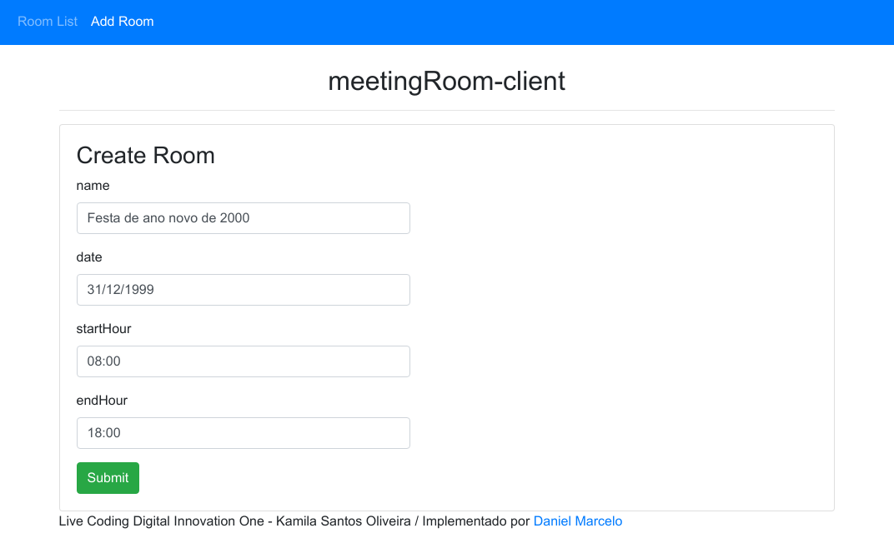
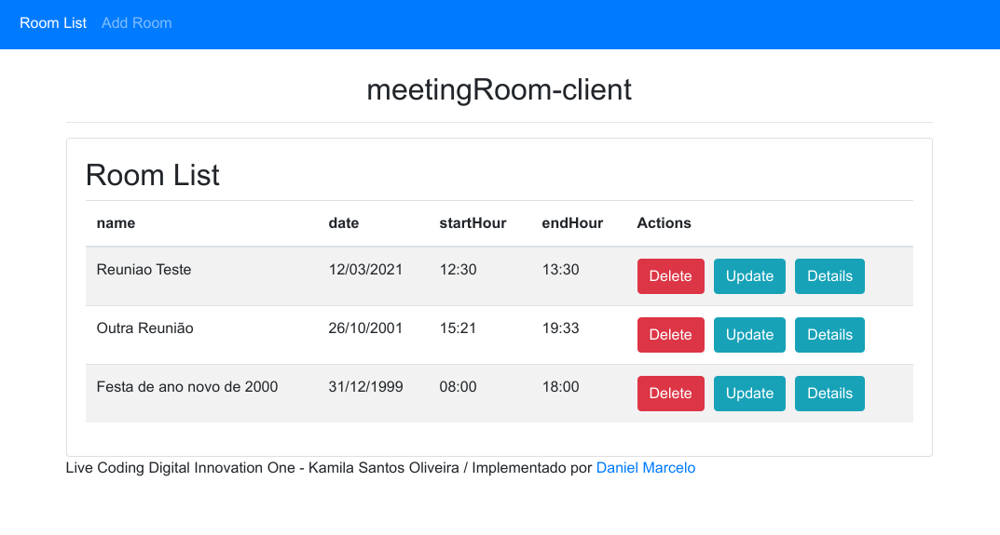
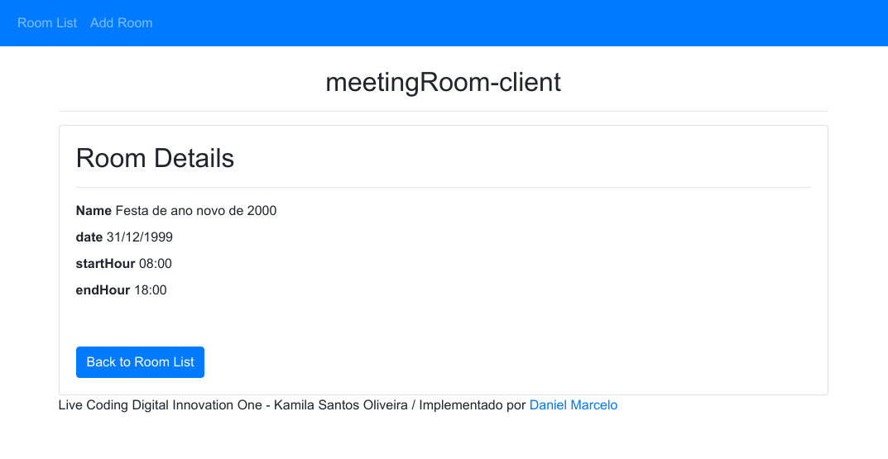

# Meeting Room Project

This is the [Angular](https://angular.io/) front-end version. Check the Java back-end [in this link](https://github.com/danielmrcl/meetingRooms-api).

## To run:

1. Clone this repo `git clone https://github.com/danielmrcl/meetingRooms-project`.
2. Download dependencies `npm install`.
3. Run `ng serve` for a dev server. Navigate to `http://localhost:4200/`.

## Requirements

- Angular CLI
- npm

## Screenshots

Path: `/add`

Path: `/rooms`

Path: `/details/:id`

## Further help

To get more help on the Angular CLI use `ng help` or go check out the [Angular CLI Overview and Command Reference](https://angular.io/cli) page.